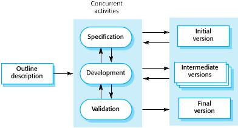
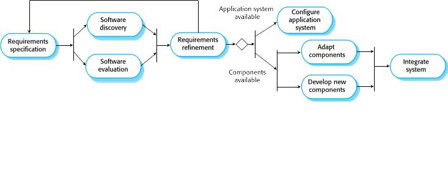

# CH1 – Introduction

* **Software:** Computer programs & associated documentation

* **Software engineering:** concerned with theories, methods, tools for software development
    * Fundamental activities: software specification, development, validation, evolution
    * A part of system engineering (hardware + software + process engineering)

* Often: Software costs > computer system / hardware cost

* Software maintenance cost > development cost

* Software products: "Generic" or "customized"

* Essential attributes of good software:
    * **Maintainability:** Critical attribute. To be able to evolve with changing needs

    * **Dependablity:** Security, reliability, safety. Should not cause damage in case of failure

    * **Efficiency**

    * **Acceptability:** Compatible with other systems, understandable, usable

---

## Application Types

### Stand-alone
* Run on a local machine (e.g a PC).
* Need not to be connected to a network
* Has all required functionality

### Interactive transaction-based
* Accessed by users externally, runs on remote computer
* Web app.s (e.g e-commerce app.s)

### Embedded control systems
* Controls and manages HW

### Batch processing systems
* Processes individual inputs in large batches

### Data collection systems
* Collect data using sensors, send to other systems to process

### Entertainment systems

### Modelling & simulation systems
* Developed by scientists & engineers for modeling
* Usually includes many separate interacting objects

### Systems of systems
* Composed of other software systems

---

* Web-based systems: Distributed & complex. Need "agile development": impractical to specify all the requirements for such systems in advance.

* Service-oriened systems: All components considered as replaceable services. Allows rapid configurations & incremental updates as new services become available.

# CH2 - Software Processes

* "Software process": Structured set of activities required to develop a software system

* Many different ones but alll involve: Specification, design & implementation, validation, evolution

* "Plan driven process": all activities planned in advance, progress is measured against the plan

"Agile process": Incremental planning, easier to change provess to changing requirements

Often, elements from both approaches are used.

## Software Process Models

### The Waterfall Model

* Plan-driven

* Separate identified phases

* Drawback: a phase has to be completed before moving onto next, hard to accomodate changes
    * Only appropriate when the requirements are well understood & changes will be limited

* Mostly used for large system engineering projects where a system is developed at several sites

### Incremental Development

* Cost of making changes reduced

* Easier to get customer feedback
    * Customers can comment on demonstrations
    * Customers can be provided with useful software earlier

* Drawbacks:
    * Regular changes may corrupt project structure - incorporating changes becomes  harder and costlier as time progresses
    * Cost-ineffective to document each system version -> Measuring progress is hard

### Integration & Configuration (Reuse-oriented SW. Eng.)

* Based on software reuse - reused elements can be configured according to requirements
* Standard approach for many business system types

* Faster delivery

* Less SW developed from scratch -> Reduced risks & costs

* Drawbacks:
    * Some requirements are likely to be unsatisfied
    * Lost control over the evolution of reused components

## Process Activities

* Can be ordered sequentially or interleaved according to the model

### Requirements Engineering Process