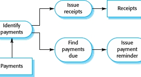
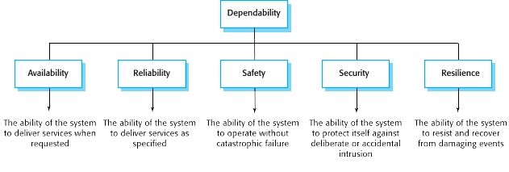
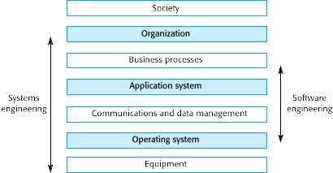

[CH1 - Introduction](#ch1---introduction)

[CH2 - Software Processes](#ch2---software-processes)

[CH3 - Agile SW Development](#ch3---agile-sw-development)

[CH4 - Requirements Engineering](#ch4---requirements-engineering)

[CH5 - System Modeling](#ch5---system-modeling)

[CH6 - Architectural Design](#ch6---architectural-design)

[CH7 - Design & Implementation](#ch7---design--implementation)

[CH8 - Software Testing](#ch8---software-testing)

[CH10 - Dependable Systems](#ch10---dependable-systems)

---

# CH1 - Introduction

* **Software:** Computer programs & associated documentation

* **Software engineering:** concerned with theories, methods, tools for software development
    * Fundamental activities: software specification, development, validation, evolution
    * A part of system engineering (hardware + software + process engineering)

* Often: Software costs > computer system / hardware cost

* Software maintenance cost > development cost

* Software products: "Generic" or "customized"

* Essential attributes of good software:
    * **Maintainability:** Critical attribute. To be able to evolve with changing needs

    * **Dependablity:** Security, reliability, safety. Should not cause damage in case of failure

    * **Efficiency**

    * **Acceptability:** Compatible with other systems, understandable, usable

---

## Application Types

### Stand-alone
* Run on a local machine (e.g a PC).
* Need not to be connected to a network
* Has all required functionality

### Interactive transaction-based
* Accessed by users externally, runs on remote computer
* Web app.s (e.g e-commerce app.s)

### Embedded control systems
* Controls and manages HW

### Batch processing systems
* Processes individual inputs in large batches

### Data collection systems
* Collect data using sensors, send to other systems to process

### Entertainment systems

### Modelling & simulation systems
* Developed by scientists & engineers for modeling
* Usually includes many separate interacting objects

### Systems of systems
* Composed of other software systems

---

* Web-based systems: Distributed & complex. Need "agile development": impractical to specify all the requirements for such systems in advance.

* Service-oriened systems: All components considered as replaceable services. Allows rapid configurations & incremental updates as new services become available.

# CH2 - Software Processes

* "Software process": Structured set of activities required to develop a software system

* Many different ones but alll involve: Specification, design & implementation, validation, evolution

* Approaches:
    * "Plan driven process": all activities planned in advance, progress is measured against the plan

    * "Agile process": Incremental planning, easier to change process to changing requirements

    * Often, elements from both approaches are used.

## Software Process Models

### The Waterfall Model

* Plan-driven

* Separate identified phases

* Drawback: a phase has to be completed before moving onto next, hard to accomodate changes
    * Only appropriate when the requirements are well understood & changes will be limited

* Mostly used for large system engineering projects where a system is developed at several sites

### Incremental Development

* Cost of making changes reduced

* Easier to get customer feedback
    * Customers can comment on demonstrations
    * Customers can be provided with useful software earlier

* Drawbacks:
    * Regular changes may corrupt project structure - incorporating changes becomes  harder and costlier as time progresses
    * Cost-ineffective to document each system version -> Measuring progress is hard

### Integration & Configuration (Reuse-oriented SW. Eng.)

* Based on software reuse - reused elements can be configured according to requirements
* Standard approach for many business system types

* Faster delivery

* Less SW developed from scratch -> Reduced risks & costs

* Drawbacks:
    * Some requirements are likely to be unsatisfied
    * Lost control over the evolution of reused components

## Process Activities

* Can be ordered sequentially or interleaved according to the model

### Requirements Engineering Process

### Software Design & Implementation

* Design: Creating software structure
    * Architectural, database, interface (between components), component selection & design
* Implementation: translating the structure into an executable
    * Design & implementation can be closely related or interleaved

### Software Validation
* Testing: Most common verification & validation activity

* V-model: Testing phases in a plan-driven software process:

### System Evolution

---

* Change anticipation: Possible changes can be anticipated without much rework
* Change tolerance: Process is designed so that changes are applied without much cost

### Software Prototyping

* Discarded after development: usually unstructured, undocumented and not standard-compliant

### Incremental Development & Delivery

* Early increments serve as prototypes

* Requirements are not changed throughout the development of an increment

* Highest priority services receive most testing

* Specification is developed toghether with the SW itself
    * May contradict procurement models of some organizations

## Process Improvement

* Process maturity approach: ?
Agile approach: focus on iterative development & reduction of overheads. Emphasis on rapid functionality delivery & adapting to requirement changes

* improvement cycle: Change -> Measure -> Analyze -> Change ...

* Process metrics:
    * Taken time to complete activities
    * Required resources for activities
    * Number of occurrences of a specific event (e.g. an error)

* SEI capability maturity model:
    1) Initial: uncontrolled
    2) Repeatable: Defined & used product management procedures
    3) Defined: Defined & used process management procedures
    4) Managed: Defined & used quality management strategies
    5) Optimising: Defined & used process improvement procedures

# CH3 - Agile SW Development

* Program specification, design and implementation are inter-leaved

* The system is developed as a series of versions or increments with stakeholders involved in version specification and evaluation

* Frequent delivery of new versions for evaluation

* Extensive tool support (e.g. automated testing tools) used to support development.

* The aim is to reduce overheads in the SW process, to be able do respond quickly to changing requirements without excessive rework.
    * e.g Minimal documentation - focus on working code

## Principles

* Customer involvement: Evaluating iterations, provide and prioritize requirements

* Incremental delivery

* People over processes: Skill of the team should be recognized - members should develop their own ways of working without prescripted processes

* Embrace change

* Maintain simplicity

## Agile development techniques

### Extreme programming (XP)

* "Extreme" iterative development:
    * New versions may be built several times per day
    * Increments are delivered to customers every 2 weeks
    * All tests must be run for every build and the build is only accepted if tests run successfully.

* Has a technical focus - usually not easy to integrate with management practice

* XP practices:
    * Incremental planning: Requirements recorded onto "story cards" -> Broken down into "Tasks"

    * Minimal useful set of functionality is developed first, frequent small releases. Functionality added incrementally.

    * Minimum design to satisfy current requirements is carried out

    * Test-first development: A functionality's test framework is implemented earlier than the functionality itself

    * Constant refactoring: All developers are expected to refactor code as soon as possible, even if there is no immediate need
        * Improves software understandability & reduces need for documentation
        * Well-structured code -> Changes are easier to make
        * Changes requiring architecture refactoring are much more expensive

    * Collective ownership: Everyone works on everything, no islands of expertise develop

    * Pair programming
        * Helps develop collective ownership
        * Informal review process
        * Encourages refactoring & sharing of knowledge

    * Continuous integration: After each task is completed, it is integrated & tested (must pass the test)
        * Test-driven development clarifies the requirements to be implemented
        * Tests are written as programs rather than data -> they can be executed automatically after integrating each new functionality

    * The customer should be available full-time as a member of the development team
        * Customer may be reluctant - may feel that providing requirements was enough

    * Large amounts of overtime are not acceptable: Reduces productivity & quality on long term

## Agile Project Management

### Scrum

* Agile method focusing on managing iterative development rather than agile practices

* "product backlog": a "TODO list", may be feature definitions, SW. requirements, user stories, supplementary tasks (e.g user documentation, architecture definition), etc.

* "scrum"s: daily meetings reviewing progress and daily tasks, ideally short f2f meeting including whole team

* "velocity": estimate of backlog covering rate of the team

* 3 phases:
    * Initial: plan outline, establish objectives (choose from backlog), design architecture
    * "Sprint cycles" of developing increments
        * fixed length (~2-4 weeks) 
    * Project closure: wrap-up & complete documentation (e.g system help frames)

* Team is isolated from distractions & customer communication. Only the "scrum master" handles communication with the customer.

* Benefits:
    * Breaks down product into managable chunks
    * Unstable requirements do not hold up
    * Whole team has visibility on everything
    * Customers see on-time increment delivery, can provide feedback
        * Establishes customer-developer trust

## Scaling Up Agile Methods

* Agile methods are successful for small & medium sized projects with small teams
    * "Scaling up": Agile methods for large SW systems with large teams
    * "Scaling out": Introducing agile methods to a large, experienced organization

### Practical problems

* Agile is informal -> incompatible with legal approach to contracts in large companies

* Agile is more approporiate for new software rather than maintenance
    * In large companies usually: Maintenance cost > development cost

* Agile is more approporiate for small co-located teams
    * SW development involves worldwide distributed teams
    * Design documents may be needed for distributed teams
        * If not available: IDE support for visualisation & program analysis is essential
    * Cross-team communication mechanisms are needed

* Agile works best when team has high skill level, but large companies have a wide range of skill level

* Software contracts are based around specifications; however, agile interleaves specification and development
    * Contract based on time rather than functionality is required for agile -> considered risky

* Maintenance problems:
    * Lack of SW documentation
        * Also needed if system is subject to external regulation
    * Customers are kept involved in development
        * Diverse set of stakeholders in large systems -> hard to involve them all in development
    * Need to keep the original team
        * Problem for long-lifetime systems

* Prioritizing changes may be difficult: Multiple stakeholders have different priorities

* Incremental delivery: Can be hard for business planning and marketing

---

* Several integrated systems: Significant amount of development on system configuration rather than development

* Completely incremental approach to requirements engineering is impossible

* Continuous integration practically impossible. However, frequent system builds & regular releases are essential

* Multi-team Scrum:
    * Releases are aligned
    * Each team has their own scrum masters and product owners
    * Each team chooses "product architect"s to design & evolve overall system architecture
    * "scrum of scrums" are done where representatives of each team meet and discuss progress

# CH4 - Requirements Engineering

* Req. eng: Establishing services a customer requires from a system & its operation and development constraints

* System requirements: Desctiptions of the system services & constraints. Generated during requirements engineering.

* "Requirement": Ranges from an abstract statement of a service / system constraint to a detailed functional specification
    * Dual function: May be the basis for a bid for a contract or for the contract itself

* User requirements: Statements in natural language + diagrams of services & operational constraints
    * Must be understandable by the end-users & customers without technical knowledge

* System requirements: Structured document, detailed descriptions of system functions, services, operational constraints.
    * Defines things to be implemented -> May be a part of a contract

* Readers of requirements specification types:

* "Stakeholder": Any person or organization who is affected by the system in some way and thus has a legitimate interest
    * End users, system managers, system owners, external stakeholders

* Agile methods use incremental requirements engineering and may express requirements as "user stories"
    * Practical for business systems
    * Problematic for systems requiring pre-delivery analysis (e.g critical systems) or systems developed by multiple teams

## Functional & Nonfunc. Requirements

* **Functional requirements:** Statements of system services, describing system's reactions to particular inputs and situations
    * May state what the system should not do
    * Depends on SW type, expected users & type of system where the SW is used
    * Functional user req.s: May be high-level statements of what the system should do
    * Functional system req.s: describes system services in detail

* **Non-functional requirements:** Constraints on system services or func.s
    * Timing constraints, development process constraints, standards, etc.
    * Often apply to the system as a whole, rather than individiual features
    * May be more critical than functional requirements
    * May be difficult to state precisely, which may be difficult to verify
        * "Goals" (general intentions of the user) can be specified instead
        * A "verifiable nonfunc. req." uses some measure that can be tested objectively
            * Speed: operation time, response time, refresh rate etc.
            * Size
            * Ease of use
            * Reliability: Failure rate, availability etc.
            * Robustness: Recovery from failure
            * Portability: Target-dependent statement rate
    * A single nonfunc. requirements may generate several related
    * Product requirements: execution speed, reliability etc.
    * Organizational requirements: Consequence of organizational policies & procedures (e.g standards, implementation requirements etc.)
    * External requirements: interoperability requirements, legal requirements etc.

* **Domain requirements:** System constraints from the operation domain

---

* In principle: Requirements should be complete & consistent:
    * Completeness: include descriptions of all required system facilities
    * Consistency: No conflicts in the descriptions of the system facilities
    * Complexity of environment & system -> impossible to produce a complete and consistent requirements document

## Requirements Engineering Process

* An iterative activity in which req. elicitation, analysis, validation and management are interleaved

### Req.s Elicitation / Discovery

* Technical staff works with stakeholders to find out about application domain, system services & system's operational constraints

* Stages (in a cycle):
    * Req.s discovery
        * Getting info. from stakeholders about the required & existing systems
            * Interviewing:
                * closed (pre-determined questions) or open, or mixed
                * Not good for understanding domain requirements: Stakeholder can unintentionally overlook them since they are already familiar with the domain
            * Ethnography: Social scientist analyzing how people work
            
                * Important social & organizational factors can be observed
                * Effective for understanding existing processes
                * Cannot identify new features to be added to a system
        * Specifying user & system requirements from the gathered info.
    * Req.s classification & organization
    * Req.s prioritization & negotiation
        * Conflicts are resolved here
    * Req.s specification
        * Req.s are documented here

* Problems:
    * Stakeholders may have unstable decisions
    * Stakeholders express req.s in their own terms
    * Stakeholders' req.s may conflict
    * Organizational & political factors may influence the req.s
    * Stakeholders & business environment may change -> Req.s change during analysis process

* User stories: Real-life system usage examples
    * Practical situation -> stakeholders can relate and comment

* Scenarios: Structured form of user stories
    * Should include starting situation, normal event flow, what can go wrong, state when scenario finishes, other concurrent activities

### Requirements specification

* Process of documenting the req.s

* Requirements are written using natural language + diagrams & tables
* Problems with NL:
    * Lack of clarity: Hard to be precise without being complex
    * Functional & nonfunc. req.s may get mixed up
    * Several req.s can be expressed together

* Form-based specifications: Definition of function/entity, description of inputs, outputs, computations, pre & post conditions, any side effects of the function

* Tabular specification: Supplements NL
    * Useful when there are alternative courses of action

* Use-cases: Identifies an interaction and involved actors
    * A set of use-cases should describe all possible interactions with the system

* SW Req. document should describe "what" the system should do rather than "how" it should do

* Incremental development -> Less detail in req.s document

## Requirements Validation

* Validating that the requirements define the system that the customer really wants

* Important: Errors in req.s are costly

* Check:
    * Validity (whether system provides func.s tht best supports customer's needs)
    * Consistency
    * Completeness
    * Realism (whether implementation with given budget & tech is possible)
    * Verifiability (whether the req.s can be tested)

* Techniques:
    * Reviews (systematic manual analyses)
        * Both client and contractors should be involved
        * Formal or informal
        * Check: Verifiability, comprehensibility, traceability (whether origin of the req. is clear), adaptability (whether the req. can be changed wtihout large impact on other req.s)
    * Prototyping
    * Test-case generation

## Requirements Management

* Managing changing req.s during req. engineering and system development
    * New req.s emerge as system is being developed and after is deployed

* Req.s mng. planning:
    * Req.s identification: Needed so that a req. can be cross-referenced with other req.s
    * Change management process: Set of activities to assess impacr & cost of changes
    * Traceability policies: Define relationships between req.s
    * Tool support

# CH5 - System Modeling

* Representing system using a graphial notation - almost always based on UML

* Models of existing systems are used during req. eng. to clarify its purpose & as a basis for strengths and weaknesses -> Lead to req.s for new system

* Models of new systems are used during req. eng. to explain req.s to other stakeholders
    * Engineers use it to discuss design proposals & document system for implementation

* Model driven engineering: Possible to implement system (partially or completely) from model

### System Perspectives

* External perspective: Model context or environment
* Interaction perpective: Model interactions between system & environment or between system components
* Structural perspective: Model organization of system or the structure of processed data
* Behavioral perspective: Model how the system responds to events

### UML Diagram Types

* Activity diagrams

* Use-case diagrams: Shows system - environment interactions

* Sequence diagrams: Shows actor - system interactions and interactions between system components

* Class diagrams: Shows object classes and the associations inbetween

* State diagrams: Shows the system's reactions to internal & external events

## Context Models

* Shows system's operational context & boundaries
    * Social and organizational concerns affects the boundary
    * Boundary position profoundly affects system req.s
    * Simply shows other systems in the environment, not how it is used or developed
        * Process models show how they are used
            * UML Activity diagrams may be used to define process models

* Architectural model: Shows relationship among systems

## Interaction Models

* Use-case and sequence diagrams may be used to model inter-system and inter-component interactions

### Use-case Diagrams

* Each use case represents a discrete task that involves external interaction with a system
    * Actors in a use case may be people or other systems
    * Represented as a diagram for overview and also in a more detailed textual form

### Sequence Diagrams

* Part of UML showing sequence of interactions taking place during a particular use-case

## Structural Models

* Display system organization in terms of its components and their relationships

* Static models: show structure of system design, dynamic models: show system organization during execution

* Created when system architecture is being created & discussed

### Class Diagrams

* Object Class: General definitiob of one kind of system obejct
    * During early stages of SW engineering: objects represent an entity in the real world

* Generalization: Base class - Derived class relation

* Aggregation association: Class is composed of other classes
    * Subclasses do not depend on aggregating class to be able to exist - similar to an "array - array element" relation

## Behavioral models

* Models a system's dynamic behavior during execution
    * Show expected response to environmental stimulus

* Types of environmental stimuli:
    * Data: input to be processed by system
    * Events: Trigger system processing
        * May or may not have associated data

* Data-driven models: Show sequence of actions in processing input & generating associated output
    * Most busines systems are data-driven, minimal external event processing
    * Shows end-to-end processing in a system -> Useful in req.s analysis

* Event-driven models: Shows system's response to external & internal events
    * Most real-time systems are event-driven, minimal data processing
    * Based on assumption that a system has finite states & events/stimuli cause transition between states
    * State machine models: Show system's responses to internal & external events
        
        * Statechart in UML are used to represent state machine models

## Model-Driven engineering

* Principal outputs of development are models rather than programs
    * Programs are later generated from models
    * Increases abstraction: Engineers no longer have to be concerned with details related to programming languages or execution platforms
    * Method is still in developments
    * Cheaper code generation but developing translators for new platforms may be expensive

* Model-driven architecture (MDA): Model a system using a subset of UML modules, at different levels of abstraction, generate implementation from model. In principle, it is possible to generate a working program without manual intervention.
    * Computation-independent model (CIM) / Domain model: Model important domain abstractions in a system
    * Platform-independent model (PIM): Model operation without referencing implementation
        * Usually described using UML to show response to stimuli & static system structure
    * Platform-specific model (PSM): Transformation of PIMs for specific platforms
        * Can be layered according to added details

* Iterative approach of MDA suggests agile, however up-front modeling contradicts.
    * Can be used in agile if PIM-to-program transformation can be fully automated

* MDA has limited adoption:
    * Limited tool availability for model conversion between abstraction levels
    * The abstractions that are useful for discussions may not be the right abstractions for implementation
    * For most complex systems, req. eng, security, dependability, backwards compatibility, testing etc. are more significant problems than implementation
    * Prevalance of agile has diverted attention away from MDA

# CH6 - Architectural Design

* Concerned with overall structure & organization of a SW system
    * Results with an "architectural model" identifying relation between system components -> Critical link between design and req.s engineerings
    * Early stage of agile processes

* Refactoring architecture affects many system components -> expensive

* Architectural abstraction:
    * Small scale: arch. of individual programs & its components
    * Large scale: arch. of large systems involving other systems & programs

* Explicit architecture benefits:
    * Used for discussion & communication with stakeholders
    * Analyzing system for wherher it can meet its nonfunc. requirements
    * An architecture can be reused for other systems

* Box & line diagram representations of architecture: Very abstract but good for communication with stakeholders

### Architecture and system characteristics

* Performance: Localize crititcal operations, minimize communications, use "larger" components

* Security: Use layered architecture with critical assets in the inner layers

* Safety: Localise safety-critical features in a small number of sub-systems.

* Availability: Include redundant components and mechanisms for fault tolerance.

* Maintainability: Use replacable components

## Architectural views

* Relate different views using use-cases & scenarios:

    * Logical view: Show key abstractions in the system as objects & object classes

    * Process view: Show how the system is composed of interacting processes at run-time

    * Development view: Show how the SW is decomposed for development

    * Physical view: Show how HW & SW components are distributed across processors in system

* Represent views with UML or architectural description lang.s (ADLs)

## Architectural patterns

* Patterns: means of representing, sharing, reusing knowledge
    * architectural pattern: stylized description of good design practice, which has been tried and tested in different environments
    * Should include info. about when they are useful and when they are not
    * May be represented using tabular & graphical descriptions

### Layered architecture

* Used to model sub-systems interface
    * Organizes system into a set of "abstract machine" layers
        * Each provides a set of services
    * Supports incremental development
        * A layer changes -> only adjacent layers affected
    * Example: layers from OS to the user interface

### Repository architecture

* Efficient data sharing mechanism when large amounts of data is shared among subsystems
    * Shared data held in central database instead of each subsystem maintaining their own databases

### Client-server architecture

* Distributed system model which shows how data and processing is distributed across a range of components
    * Can be implemented on a single computer
    * Set of stand-alone "servers" providing specific services, "clients" calling these services & "network" providing clients access to the servers

### Pipe & Filter architecture

* Input -> functional transformations -> output

* If transformations are sequential: "batch sequential model", used extensively in data processing systems

* Not very suitable for interactive systems

## Application architectures

* Architecture for a type of system that may be configured and adapted to fulfill specific requirements.

* Used as:
    * A starting point for architectural design.
    * A design checklist.
    * Way of organising the work of the development team.
    * Means of assessing components for reuse.
    * To discuss application types.

* Two widely used generic app. architectures:
    * Transaction processing systems

        
        * Data centered app.s provessing user requests & updating info in a system database
        * Users make asynchronous requests for service which are then processed by a transaction manager
        * E-commerce sys.s, reservation sys.s, etc.
    * Language processing systems

        
        * App.s where user specifies intentions in a formal language, which is processed & interpreted by the system
        * Compilers, command interpreters etc.
        * Compiler components:
            * Lexical analyzer: Converts language tokens to internal form
            * Symbol table: holds info. about names of entities used in text
            * Syntax analyzer
            * Syntax tree: internal structure of the program being compiled
            * Semantic analyzer: Uses info. from syntax tree & symbol table to check semantic correctness of text
            * Code generator: "Walk" syntax tree to generate abstract machine code

            Repository compiler architecture:

            

            Pipe & filter compiler architecture:

            
    
### Information systems architecture

* Can be organized in layers
    * Layers: UI, User communications, info. retrieval, system database...
    * Transaction-based since interaction with these systems generally involves database transactions

# CH7 - Design & Implementation

* Implementation: Realizing the design as a program

* Developing a modifiable "off the shelf system": design process is concerned with the configuration features

## Object-Oriented Design With UML

* Involve developing a number of different system models - may not be cost-effective for small systems

* Common activities include:

### 1) Defining system context & interactions

* Defines relationship between software and external environment

* Establishes system boundaries - helps decide which features to implement

* **System context model:** Demonstrates other systems

* **Interaction model:** e.g. Use case model & descriptions

### 2) Designing system architecture

* Organize components in an architectural pattern (e.g. layered, client-server...)

### 3) Identifying object classes

* Relatively difficult & an iterative process
    * Considering tangible entities & scenerio based analysis (as in use case model) helps
    * In the system's verbal description: Generally objects & attributes correspond to nouns, operations & services correspond to verbs

### 4) Developing design models

* **Design model:** Shows relations between objects/object classes
    * **Structural model:** Describes static structure of object classes & relationships
    * **Dynamic model:** Describes dynamic interactions between objects

#### Examples:

* **Subsystem models:** Show logically related groups of objects
    * Shown with "packages" in UML

* **Sequence models:** Show sequence of object interactions

* **State diagrams:** Show objects' response to service requests & triggered state transitions
    * Useful for modeling run-time behavior
    * Not needed / Unnecessarily complex for most objects

* Also use case models, aggregation models, generalisation models... etc

### 5) Specifying object interfaces

* Specifying interafaces allows designing objects in parallel

* UML: Class diagrams

## Design Patterns

* Ways of reusing abstract knowledge: a description of a problem and the essence of its solution

* Consists of:
    * Name
    * Problem description
    * Solution description (as a template for design)
    * Consequences (& trade-offs)

* Pattern examples: Observer, Façade, Iterator, Decorator...

## Implementation Issues

### Reuse

* Existing code should be used as much as possible

* Reuse costs:
    * **Searching** for reusable software
    * **Buying** reusable software
    * **Adaptation** of reusable software
    * **Integrating** reusable software with each other

#### Reuse levels

* **Abstraction level:** Reuse knowledge of successful abstractions

* **Object level:** Reuse objects from an existing library

* **Component level:** Reuse collections of objects & object classes

* **System level:** Reuse entire application systems

### Configuration management

* Supporting the system integration process so that all developers can access the project code and documents in a controlled way, find out what changes have been made, and compile and link components to create a system

#### Config. man. activities

* Version management
* System integration (Define versions of used components)
* Problem tracking
* Release management

### Host-Target Development

* Consider development & execution platform differences
    * Sometimes more or less the same (e.g. Java Virtual Machine)
    * Sometimes different (e.g embedded systems): Need simulations & testing

## Open Source Developnent

* Avaliable source & volunteers are invited do particitpate in development

* Open source business: Selling support for software rather than software product itself
    * Intention: Cheaper & quicker development and forming a community of users

* Licensing: Open source sofware need not be freely used & manipulated. Restrictions may apply

# CH8 - Software Testing

## Program Testing

* Executing program with artificial data

* **Defect/Verification testing:** Discover possible defects before putting the program into use
    * Can use deliberately obscure test cases
    * Does not guarantee absence of errors
    * "Are we building the product right?"

* **Validation testing:** Demonstrate program to developers & customers
    * At least one test for each requirement in SRS
    * "Are we building the right product?"

* Verification & Validation (V&V) confidence dependss on softwaree purpose, user expectations, marketing environment
    * Early publishing to market is sometimes more important than finding defects

### Software inspection

* **Software inspection:** static verification, **software testing:** dynamic verification

* Doesn't require execution

* Can check conformance with a standard

* Unlike testing, incomplete program can be verified without additional costs

* Unlike testing, cannot check performance, usability etc.

* Both inspections and testing should be used in V&V

## Testing stages:

## 1) Development Testing

### Unit testing

* Testing components individually (for defects)

* Example units:
    * Functions/Methods of an object
    * Object classes
    * Composite components & their interfaces

* Testing object classes: Inheritance is more difficult to test as tested information is not localized

* Should be automated whenever possible
    * Setup, call, assertion (checking) stages

#### Choosing unit testing cases:

* 2 unit test case types:
    * Normal operation (usual cases)
    * Abnormal inputs (edge cases)

* **Partition testing:** Process inputs with similar characterstics together, test inputs from each "equivalence class"

* **Guideline-based testing:** Tests reflecting previous experience, common errors, edge cases
    * Forcing system to generate all errors
    * Force input buffer overflow
    * Repeat same input multiple times
    * ... etc.

### Component testing

* Testing composite components & showing that the component interface behaves in accordance with specification

* Assume unit tests within component are completed

* Interface types:
    * **Parameter interfaces:** Passed data between methods/procedures

    * **Shared memory intercafes:** Block of memory shared among methods/procedures

    * **Procedural interfaces:** Encapsulated procedure set of a sub-system to be called by other sub-systems

    * **Message passing interfaces**: Service requests among sub-systems

* Interface errors:
    * **Interface misuse:** A component calls another component erroneously

    * **Interface misunderstanding:** A caller component makes wrong assumptions about the called component

    * **Timing errors:** Caller and called components operate at different speeds and out-of-date or premature information is accessed

### System testing

* Integrate components to create a system version & test it
    * Teams developing different components may come toghether for testing. Some companies have separate testing teams for system testing

* Test interaction and compatibility between components
    * "Emergent behavior" of the system

* Use-cases can be used as a basis as they usually force component interaction

* Exhaustive testing is impractical: Policies defining test coverages may be developed

### Test-driven Development

* Write tests before increments, aim to pass tests during development. Do not move on to next increment until test is passed
    * Introduced as part of agile

#### Benefits

* **Code coverage:** every code segment is tested at least once

* **Regression testing:** Test suite is developed incrementally with the program - It can always be checked whether new code introduces new bugs

* **Simplified debugging**

* **System documentation:** Tests form a documentation describing what the code should be doing

## 2) Release Testing

* Testing a release which is for outside development team

* A form of system testing, except:
    * A team separate than development team should be responsible for testing
    * System testing focuses on verification, release testing focuses on validation

* Shows system delivers its specified functionality, performance and dependability, does not fail during normal use

* Usually black-box where tests are derived from system specification

* **Requirements-based testing:** Examine each requirement & develop test/s for them

* **Scenario testing:** Devise usage scenarios & use them to develop tests

* **Performance testing:** Testing emergent properties of system (e.g performance, reliability)
    * Steadily increase load until performance becomes unacceptable
    * Stress testing: Deliberately overload system to test failure behavior

## 3) User testing

* Users / customers provide input & system testing advice

* Essential since influences from user's working environment cannot be exactly replicated in a testing environment
    * User's environment affects reliability, performance, usability, robustness of a system

* **Alpha testing:** Users and developers work together

* **Beta testing:** A release is available to the users for them to experiment with and raise problems to developers

* **Acceptance testing:** Customers test whether system can be accepted from system dev.s & deployed.
    * Primarily for custom systems
    
    * In agile: Tests are defined by the user/customer. No separate acceptance testing process
        * Main problem is whether the user working with the team can represent a general user

# CH10 - Dependable Systems

* Dependability: Reflects user's degree of trust in a system

* Failure causes:
    * Hardware failure
    * Software failure (erroneous specification, design or implementation)
    * Operational failure (mistakes by human operators)

## Dependability Properties

Also:

* **Repairability:** Extent to which system can be repaired in case of failure

* **Maintainability:** Extent to which system can be adapted to new requirements

* **Error tolerance:** Extent to which system can avoid or tolerate user input errors

* Dependability costs increase exponentially as required dependability level increases
    * V&V is expensive
    * Dependability can be compromised depending on social & political factors

## Sociotechnical Systems

* Software systems are components of broader systems with social & organizational purpose

* 
    * Equipment: HW
    * Communications & data mgmt.: Middleware providing access to db.
    * Application systems: Specific functionality to meet some organization requirements.
    * Society: Laws, regulation, culture affecting operation of the system

* **Holistic ("bütünsel") system design:** Consider other layers of socio-tehnical system for dependability. A failure in a layer should not propogate to others

### Regulation & compliance

* Companies developing safety-critical systems (e.g. nuclear systems, medical devices, air traffic systems) have to produce an extensive safety case showing that regulations are followed
    * Sometimes as expensive to prepare documentation as to develop system itself

## Redundancy & diversity

* **Redundancy:** Keep multiple versions of critical components for backup

* **Diversity:** Provide same functionality in multiple ways to lower chance of failure in the same way

* Redundant and diverse components should be independent to avoid common ("ortak") failures

